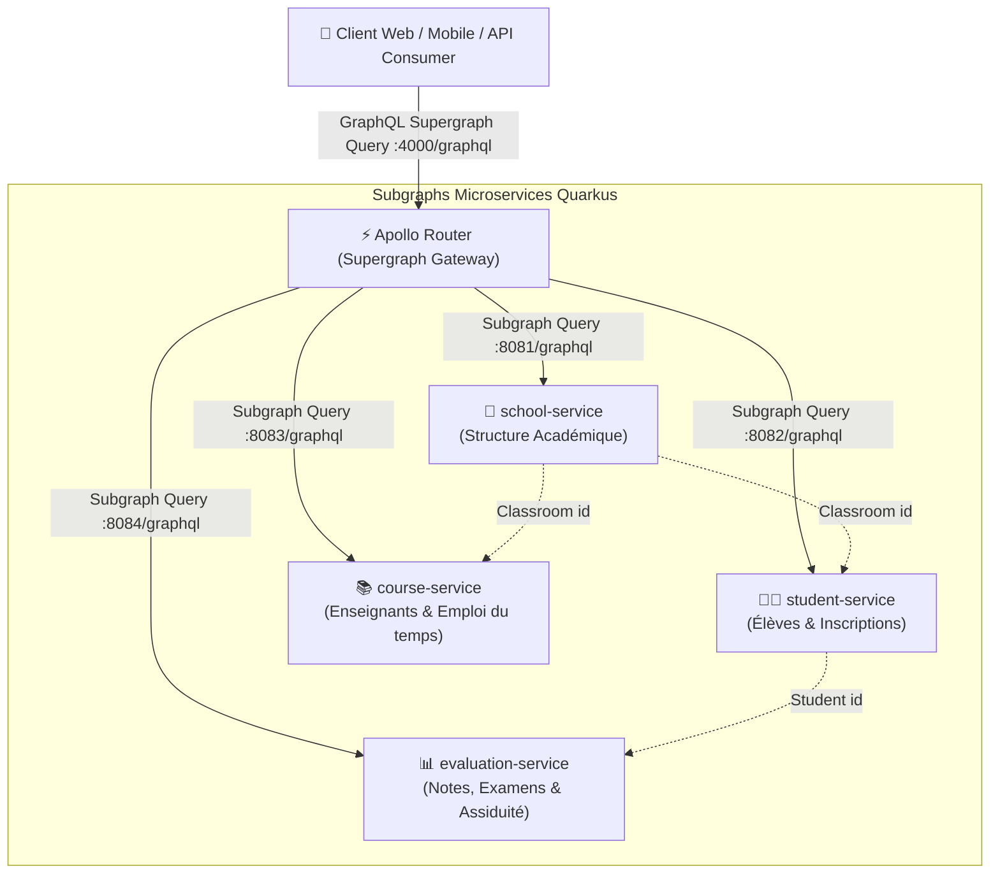

# 🎓 Plateforme de Gestion des Écoles - Architecture Microservices & Apollo Federation

Ce projet implémente une architecture moderne, distribuée et hautement performante pour la **gestion d'établissements scolaires**, construite avec **Quarkus 3.x (Java 21)** et unifiée par **Apollo Federation (Supergraph)**.

---

## 🏛️ 1. Vue d'Ensemble de l'Architecture

L'architecture repose sur le paradigme **Apollo Federation v2** et le principe **Database-per-Service** du *Domain-Driven Design* (DDD) :



---

## 📦 2. Découpage des 4 Microservices (Subgraphs)

| Service | Port | Bounded Context | Rôle & Entités Principales | Extensions Fédérées |
| :--- | :---: | :--- | :--- | :--- |
| **`school-service`** | `8081` | Structure & Établissements | `School`, `Classroom` (clé `@Key(fields = "id")`), gestion des niveaux, filières et capacités. | Fournit la racine de l'entité `Classroom`. |
| **`student-service`** | `8082` | Gestion des Élèves | `Student` (clé `@Key(fields = "id")`), dossiers administratifs, matricules. | Étend `Classroom` avec `students: [Student]`. |
| **`course-service`** | `8083` | Enseignants & Cours | `Teacher`, `Subject`, `CourseSession`, gestion des créneaux et des salles. | Étend `Classroom` avec `courses: [CourseSession]`. |
| **`evaluation-service`**| `8084` | Évaluations & Présences | `Exam`, `Grade`, `AttendanceRecord`, calcul de moyennes pondérées (GPA). | Étend `Student` avec `grades: [Grade]`, `gpa: Float`, `attendances`. |

---

## 🧩 3. Mécanisme de Résolution Fédérée dans Quarkus

Chaque microservice utilise l'extension `quarkus-smallrye-graphql` avec le support d'Apollo Federation activé :
```properties
quarkus.smallrye-graphql.federation.enabled=true
quarkus.smallrye-graphql.federation.batch-resolving-enabled=true
```

### Exemple 1 : Définition de l'entité de base (`school-service`)
```java
@Key(fields = @FieldSet("id"))
public class Classroom {
    @Id
    private String id;
    private String name;
    private Integer capacity;
    // getters / setters
}
```

### Exemple 2 : Extension d'entité avec résolveur de champ (`student-service`)
```java
@Extends
@Key(fields = @FieldSet("id"))
public class Classroom {
    @Id
    @External
    private String id;
}

@GraphQLApi
public class StudentGraphQLApi {
    // Cette méthode attache automatiquement le champ students à Classroom !
    public List<Student> students(@Source Classroom classroom) {
        return studentRepository.findByClassroomId(classroom.getId());
    }
}
```

---

## 🚀 4. Démarrage Rapide

### Prérequis
- **Java 21**
- **Apache Maven 3.9+**
- **Docker & Docker Compose**

### A. Compilation globale du projet
Depuis la racine du projet `school-management-system` :
```bash
mvn clean package -DskipTests
```

### B. Lancement avec Docker Compose
Pour démarrer l'ensemble des 4 microservices Quarkus et la passerelle Apollo Router :
```bash
docker compose up --build -d
```

### C. Vérification de l'état de santé
- **Apollo Router** : [http://localhost:4000](http://localhost:4000) (Apollo Sandbox Explorer)
- **school-service** : [http://localhost:8081/q/health](http://localhost:8081/q/health) & UI GraphQL [http://localhost:8081/q/graphql-ui](http://localhost:8081/q/graphql-ui)
- **student-service** : [http://localhost:8082/q/health](http://localhost:8082/q/health)
- **course-service** : [http://localhost:8083/q/health](http://localhost:8083/q/health)
- **evaluation-service** : [http://localhost:8084/q/health](http://localhost:8084/q/health)

---

## 🧪 5. Exemples de Requêtes GraphQL Fédérées

Toutes ces requêtes sont exécutées sur le point d'entrée unique de la Supergraph :
**`POST http://localhost:4000/graphql`**

### Requête 1 : Vue 360° d'une classe (Agrégation des 4 microservices en une seule requête !)
Cette requête résout simultanément les données de `school-service`, `student-service`, `evaluation-service` et `course-service` :

```graphql
query GetCompleteClassroomOverview {
  classroom(id: "class-101") {
    id
    name
    gradeLevel
    capacity
    
    # Résolu par student-service
    students {
      id
      firstName
      lastName
      email
      matricule
      
      # Résolu par evaluation-service
      gpa
      grades {
        score
        maxScore
        comment
        exam {
          title
          subjectCode
        }
      }
      attendances {
        date
        sessionName
        status
      }
    }
    
    # Résolu par course-service
    courses {
      id
      dayOfWeek
      startTime
      endTime
      room
      subject {
        name
        code
        coefficient
      }
      teacher {
        firstName
        lastName
        specialty
      }
    }
  }
}
```

### Requête 2 : Liste de tous les établissements avec leurs classes
```graphql
query GetAllSchoolsAndClasses {
  allSchools {
    id
    name
    city
    classrooms {
      id
      name
      code
    }
  }
}
```

### Requête 3 : Inscrire un élève et enregistrer une note (Mutations)
```graphql
mutation EnrollAndGrade {
  enrollStudent(
    firstName: "Sarah"
    lastName: "Diallo"
    email: "sarah.diallo@ecole.fr"
    matricule: "ETU-2026-088"
    classroomId: "class-101"
  ) {
    id
    firstName
    lastName
  }
}
```

---

## 🛠️ 6. Intégration Continue avec Jenkins

Un pipeline Jenkins déclaratif type peut être configuré dans votre instance Jenkins locale :

```groovy
pipeline {
    agent any
    tools {
        maven 'Maven-3.9'
        jdk 'JDK-21'
    }
    stages {
        stage('Checkout') {
            steps { checkout scm }
        }
        stage('Build & Test All Subgraphs') {
            steps {
                dir('school-management-system') {
                    sh 'mvn clean package'
                }
            }
        }
        stage('Compose Apollo Supergraph') {
            steps {
                dir('school-management-system/apollo-router') {
                    // Validation rover (optionnel)
                    // sh 'rover supergraph compose --config supergraph.yaml'
                }
            }
        }
        stage('Docker Build') {
            steps {
                dir('school-management-system') {
                    sh 'docker compose build'
                }
            }
        }
    }
}
```


recommndation et amelioration 
Priorité 1 (Immédiat - Stabilisation)
Corriger le démarrage local :
Soit créer un script Node.js apollo-router/gateway.mjs utilisant @apollo/gateway pour le dev hors Docker.
Soit adapter 

start-all.ps1
 pour télécharger et exécuter le binaire Windows natif router.exe avec ./supergraph-local.graphql.
Ajouter un Jenkinsfile déclaratif complet à la racine du projet pour valider le build Maven et la composition Supergraph.
Sécuriser les calculs : Vérifier que maxScore > 0 dans 

EvaluationRepository.java
 pour éviter les NaN/Infinity.
 
Priorité 2 (Moyen Terme - Robustesse & Production)

Suite de tests : Créer des tests d'intégration avec @QuarkusTest pour valider les endpoints GraphQL et le bon fonctionnement de la fédération.
Persistance réelle : Remplacer les ConcurrentHashMap par quarkus-hibernate-orm-panache et des bases PostgreSQL légères (gérées dans le docker-compose.yml).

Priorité 3 (Évolution - Sécurité & Observabilité)
Sécurité : Intégrer l'extension quarkus-oidc ou un mécanisme JWT relayé par l'Apollo Router vers les subgraphs pour sécuriser les mutations.
Observabilité : Activer OpenTelemetry (quarkus-opentelemetry) pour tracer les requêtes fédérées de bout en bout (du client jusqu'aux subgraphs à travers l'Apollo Router).
Souhaitez-vous que l'on commence par corriger le lanceur local (start-all.ps1 / apollo-router), ajouter le Jenkinsfile, ou mettre en place des tests d'intégration pour les microservices ? 